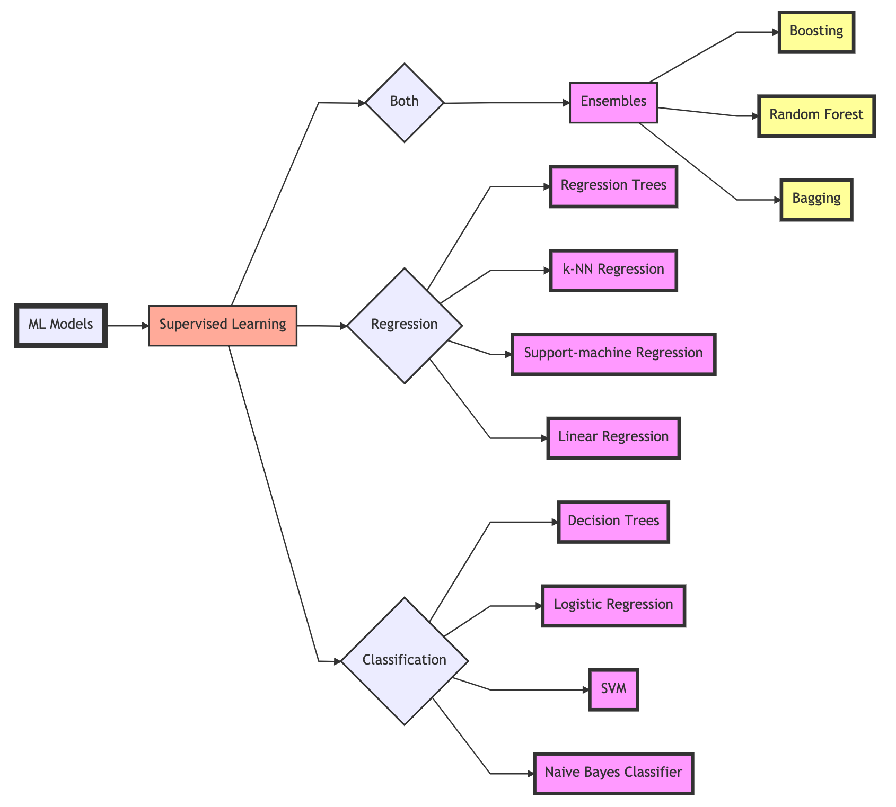
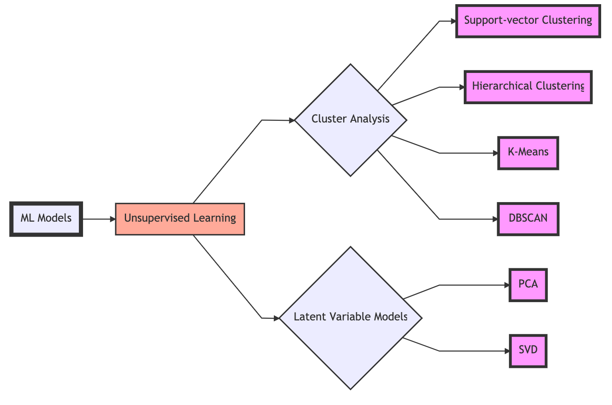
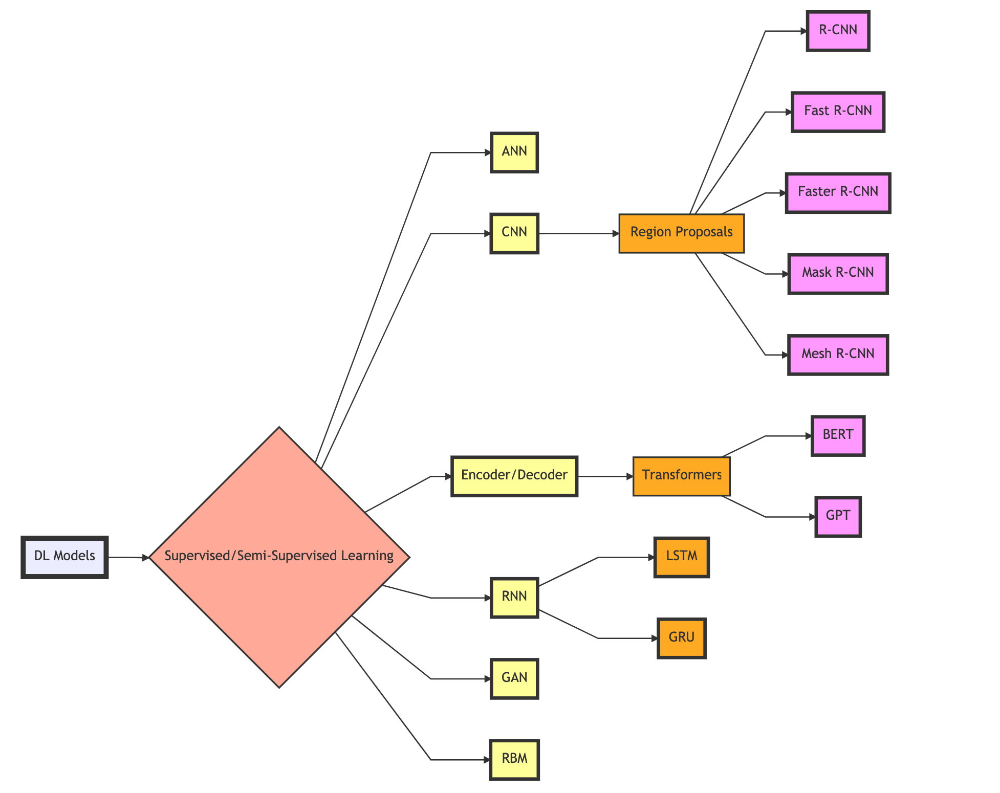
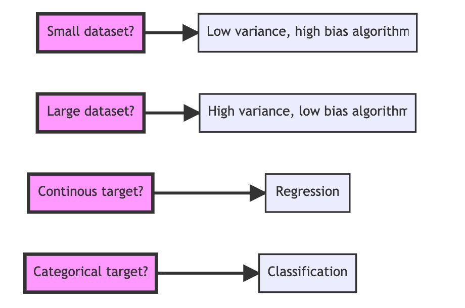
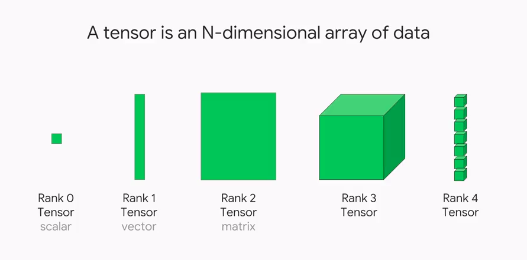
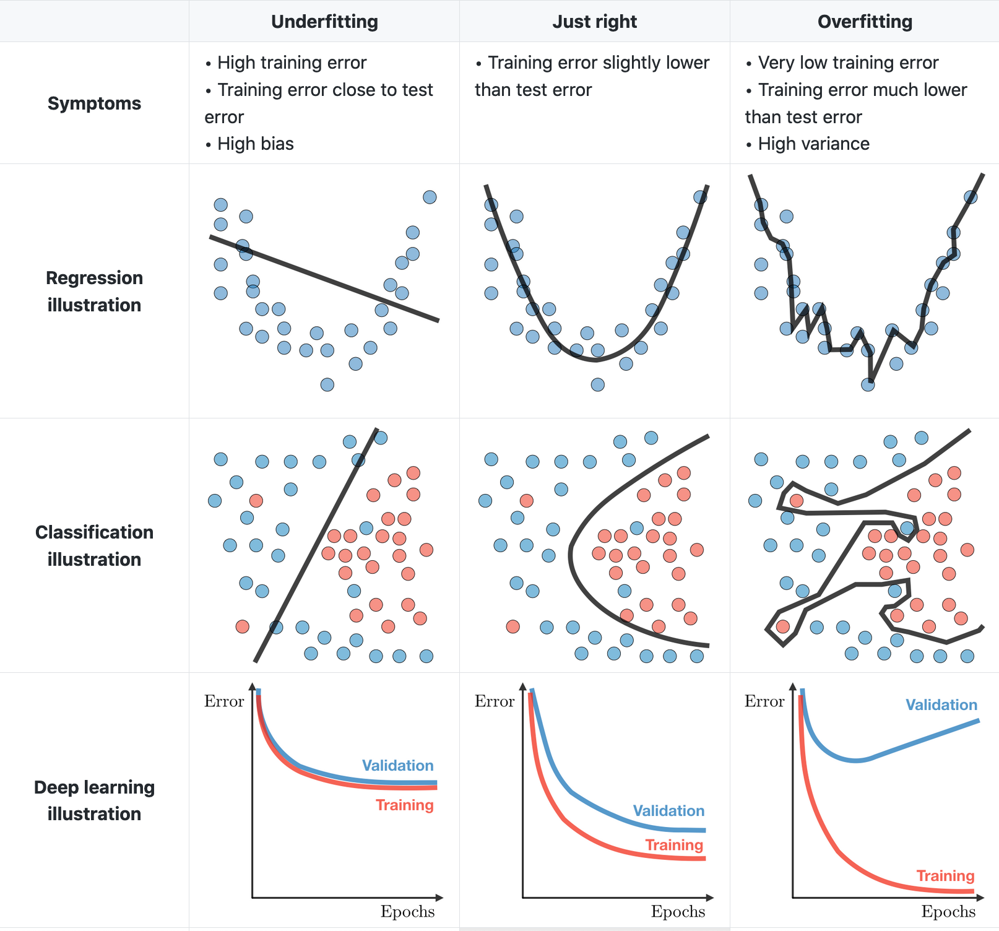

**A Somewhat Comprehensive Guide to Deep Learning: Data - Part 1**

- [Introduction and Intention](#introduction-and-intention)
  - [A Brief Historical Tangent in ML and DL and Ethics](#a-brief-historical-tangent-in-ml-and-dl-and-ethics)
  - [Deep Learning and Machine Learning Resources](#deep-learning-and-machine-learning-resources)
  - [What is Machine Learning?](#what-is-machine-learning)
  - [What is Deep Learning?](#what-is-deep-learning)
    - [Transfer Learning and Research Papers](#transfer-learning-and-research-papers)
- [Useful Libraries, Functions, and Methods](#useful-libraries-functions-and-methods)
  - [Numpy](#numpy)
  - [Pandas](#pandas)
  - [Scikit-learn](#scikit-learn)
  - [TensorFlow](#tensorflow)
  - [Matplotlib](#matplotlib)
- [Unraveling Terminology](#unraveling-terminology)
  - [Data](#data)
  - [Model](#model)
  - [Objective Functions](#objective-functions)
  - [Optimizing Algorithms](#optimizing-algorithms)
- [Process of Implementing and Deploying Deep Learning Models](#process-of-implementing-and-deploying-deep-learning-models)
- [Understanding the Problem](#understanding-the-problem)
  - [Tips For Learning Deep Learning Online](#tips-for-learning-deep-learning-online)
- [Understanding the Data and Loading it](#understanding-the-data-and-loading-it)
  - [Geometric Intuition of Data](#geometric-intuition-of-data)
  - [Scalars, Vectors, Matrices, and Tensors](#scalars-vectors-matrices-and-tensors)
  - [Shape of Data](#shape-of-data)
  - [Continuous and Categorical Variables](#continuous-and-categorical-variables)
  - [Data Augmentation](#data-augmentation)
  - [Structured and Unstructured Data](#structured-and-unstructured-data)
  - [Splitting Data](#splitting-data)
  - [Cross-Validation](#cross-validation)
  - [Underfitting and Overfitting](#underfitting-and-overfitting)
  - [Bias and Variance](#bias-and-variance)
  - [Handling Missing Data and Imbalanced Data](#handling-missing-data-and-imbalanced-data)
    - [Handling Missing Data](#handling-missing-data)
    - [Handling Imbalanced Data](#handling-imbalanced-data)
    - [Datasets](#datasets)
    - [Code Snippet: Dataset Splitting in Scikit-Learn](#code-snippet-dataset-splitting-in-scikit-learn)
    - [Code Snippet: Loading Data TensorFlow Code Example](#code-snippet-loading-data-tensorflow-code-example)
- [Note](#note)
- [References](#references)


# Introduction and Intention

Machine learning (ML) and deep learning (DL) are fields in constant flux and a state of evolution and innovation, and at times ill-defined. Few educational intuitions offer a comprehensive and standardized pedagogical approach in learning ML and DL. Furthermore, there are an array of online courses with self-professed experts that provide a shallow introduction to ML and DL. They fail to share adequate mathematical intuitions and tend to make outrageous claims on what DL can do (i.e. "predict" stock prices with an RNN based solely on historical prices) and fail to express the depth and excitement of the bleeding edge of DL.

My intention with this guide is to clear up some confusion about the subject, to provide a primer and a refresher on a variety of algorithms used in ML and DL in an organized fashion, and to demonstrate pragmatic approaches and perspectives to ML and DL. I view this guide as a jumping-off point, not a be-all resource. I've distilled tidbits of information and code snippets into this guide, along with research papers and helpful third-party resources. I assume that my reader has some background knowledge. If not, then the aptitude to be a self-learner and the ability to look up these concepts for further clarification. 

Terms within machine learning tend to be inconsistently defined and frequently used interchangeably. A prime example is the term machine learning, deep learning, and artificial intelligence. In this guide, I distinguish machine learning and deep learning and disregard artificial intelligence as a misnomer and an ill-adapted phrase. When we talk about machine learning, it'll be about shallow modeling techniques that are typically not layered and typically work well in low-dimensional and structured data environments. Deep learning is the opposite. These techniques are layered and operate well in high-dimensional data environments with a range of structures. Our ultimate goal is to build well-performant models within an ecosystem that inputs data and outputs something meaningful.

**Machine Learning**: A set of algorithms that utilize data to learn transformations between inputs and outputs. They perform a function with the data given to it and gets progressively better over time.

**Deep Learning**: A subset of machine learning that consists of a series of models that learn multiple layers of transformations, where each layer offers a representation at each level. It uses a layered network that learns representations of the data, where this learning occurs iteratively and is then evaluated and applied toward problems in a similar domain.

## A Brief Historical Tangent in ML and DL and Ethics

In a time not too long ago, computation was expensive and the distributive computing systems that were in place were insufficient to handle these multi-layered deep learning networks and the relevant data transformations and extractions needed. Some of the seminal works were theorized during a time called the AI Winter. There was an immense amount of hype in machine learning, and when these systems could not deliver in the '70s and '80s, there was a momentous drop-off in ML related funding. Arguably, in the 2010s, we have seen the rise and are currently experiencing an AI Spring. We now have the infrastructure, the skills, and the computation to properly train and implement these multi-layered systems, along with time-saving and computationally efficient implementations like transfer learning. This does not mean that we are in a period of infinite growth and where success is a guarantee. We are yet to achieve breakthrough status in some of the biggest autonomous problems, like true Level Four autonomous driving in a busy city, true long-form language generation systems, and effective knowledge systems. Things could drop-off precipitously, or simply grow too slowly. In DL and autonomous technologies, it's easy to fall into an infinite growth fallacy or to be reassured of the notion of perpetually improving systems. 

This is where *you* come in. As a machine learning engineer, I find it to be an obligation and a duty to push this field forward. To challenge assumptions, to call out insufficient research and methodologies, to praise and uphold sufficient research, and more importantly, to contribute in some way. The exciting part about this field is if it works, it works. Keep in mind, we can always do better. Our goal is to be *more* than trained technicians. We want to implement new ideas, to demonstrate a better way of doing things, to expose bias where it exists, and not to use this technology for regressive purposes. 

## Deep Learning and Machine Learning Resources

I implore anyone reading this and following along to check out the resources below. It's not a comprehensive or complete list, but it is an excellent companion. All the resources below are free, and in my humble opinion, learning ought to be inexpensive and easily accessible. Be wary of online courses that could end up cost hundreds of dollars. Both paid professors and self-professed experts are perfectly capable of creating online courses that are more wasteful than productive. Before dishing out any cash, be sure you know that the person teaching is not an online marketer posing as a machine learning engineer. There are dozens, if not hundreds of courses that fall into this category.

**Further Learning resources**:

1. **[Fast.ai](https://fast.ai)**: Filled with engaging tidbits, insightful implementations, and fun and down to earth commentary. Level up your DL skills quickly and in a friendly manner.
2. **[TensorFlow Tutorials](https://www.tensorflow.org/tutorials)**: A great way to learn DL while implementing it.
   1. Alternatively, a TensorFlow crash-course: **[ML Crash Course](https://developers.google.com/machine-learning/crash-course/ml-intro)**
3. **Stanford CS Cheatsheets**: A series of cheatsheets that are well-organized, concise, and well-defined.
   1. **[Stanford CS 221 - Artificial Intelligence](https://stanford.edu/~shervine/teaching/cs-221/)**
   2. **[Stanford CS 229 - Machine Learning](https://stanford.edu/~shervine/teaching/cs-229/)**
   3. **[Stanford CS 230 - Deep Learning](https://stanford.edu/~shervine/teaching/cs-230/)**
4. **[Shape of Data](https://shapeofdata.wordpress.com/)**: A left-field recommendation that deals mostly with understanding data as geometric objects. The explanations are on-point, but may require a re-read for the information to really sink in.
5. **[Papers With Code](https://paperswithcode.com/sota)**: A curated source of research papers with some explanations. 

## What is Machine Learning?

Machine learning solves geometric problems by broadly leveraging linear algebra, matrix decomposition, calculus, and statistical methods to fit a mathematical representation to some data to ultimately output a prediction, classification, cluster, association, or ranking given what the algorithm learned about the data. General machine learning is shallow models where the data lacks complex dimensionality. Higher-dimensional data works best-using a subset of machine learning called deep learning. It is tempting to disregard a traditional machine learning technique for a shiny new deep learning technique, but I recommend that you do not disregard some of these techniques. Sometimes, an ensemble model can provide above par results on a structured dataset with less computational overhead.



There are subsets of machine learning, one being deep learning. Machine learning and deep learning contain supervised, semi-supervised,  unsupervised, and reinforcement techniques. Modern deep learning architectures are increasingly semi-supervised (a combination of supervised and unsupervised) and reinforced. When we talk about supervision in ML, it is how the model learns the data.



## What is Deep Learning?

When we mention deep learning, we are talking about a subset of models that use a network containing more than one layer to transform and extract features and learn patterns from input data, where each layer offers a representation at every level.

Deep learning contains networks like artificial neural networks (ANN, AKA, multi-layered perceptrons), recurrent neural networks (RNN), convolutional neural networks (CNN), general adversarial networks (GAN), restricted Boltzmann machines (RBM), and transformers. Networks like GANs, RBMs, and transformers are semi-supervised, unsupervised, or fully supervised. Examples of unsupervised networks are self-organizing maps (SOM), autoencoders (AE), deep belief networks (DBN), and deep embedding clustering (DEC). Of course, there are always exceptions to how we may train and implement these networks. When practically everything can be tweaked and redefined, these categories become slippery and ever-morphing.

Along with deep learning, we have reinforcement learning (RL) and deep reinforcement learning (DRL). We will not be covering RL since it is an entire topic in its own right. I encourage you to look into it. There are some incredible advancements in RL that I believe will revolutionize autonomous learning systems. 

To understand the difference among all of them, see this StackOverflow answer:

>The goal of **machine learning** methods is to learn rules from data and make predictions and/or decisions based on them. The learning process can be done in a(n) supervised, semi-supervised, unsupervised, reinforcement learning fashion.

>In **reinforcement learning (RL)**, an agent interacts with an environment and learns an optimal policy, by trial and error (using reward points for successful actions and penalties for errors). It is used in sequential decision making problems.

>**Deep learning** as a sub-field of machine learning is a mathematical framework for learning latent rules in the data or new representations of the data at hand. The term "deep" refer to the number of learning layers in the framework. Deep learning can be used with any of aforementioned learning strategies, i.e.,supervised, semi-supervised, unsupervised, and reinforcement learning.

>A **deep reinforcement learning** technique is obtained when deep learning is utilized by any of the components of reinforcement learning. Note that Q-learning is a component of RL used to tell an agent that what action needs to be taken in what situation. 
[StackOverflow Answer](https://stackoverflow.com/questions/50542818/whats-the-difference-between-reinforcement-learning-deep-learning-and-deep-re), submitted by [Roy](https://stackoverflow.com/users/12520013/roy)



### Transfer Learning and Research Papers

There are steep advances in deep learning thanks in part to transfer learning and novel architectures to existing networks. **Transfer learning** is the process of applying pre-trained models, or trained weights, into your architecture, where these weights require little to no training. Pre-trained models are trained on a lot of data using a particular architecture. This advancement has allowed more people to use state-of-the-art models in their implementations without burdening the end-user with thousands of dollars of training costs.

Most of the papers below are some incarnation of transfer learning, novel architectures, or creative implementations of DL. These papers may be advanced, yes, but I'm confident that most people will be able to glean something useful from them. Getting into the habit of reading papers will be crucial. ML is an evolving field. Improvements in existing architectures, novel implementations, and new architectures are published *frequently*. Paper recommendations will be throughout this guide.

Some seminal papers and architectures are down below:

**Image classification**:

**ResNet**: A CNN model with up to 152 layers.
- **Repository**: https://github.com/KaimingHe/deep-residual-networks
- **Paper**: https://arxiv.org/pdf/1512.03385.pdf
- **Year**: 2015

**VGG**: Deep CNN model with up to 19 layers. 
- **Repository (TensorFlow)**: https://github.com/machrisaa/tensorflow-vgg
- **Paper**: https://arxiv.org/pdf/1409.1556.pdf
- **Year**: 2015

**Inception-v4**: Deep CNN model for image classification.
- **Repository**: https://github.com/kentsommer/keras-inceptionV4
- **Paper**: https://arxiv.org/pdf/1602.07261.pdf
- **Year**: 2016

**Object detection**:

**YOLOv4**: A deep CNN model for real-time object detection. One-sage object detection that improves on YOLOv3. 
- **Repository (Darknet)**: https://github.com/pjreddie/darknet
- **Paper**: https://arxiv.org/abs/2004.10934
- **Year**: 2020

**Mask R-CNN**: A real-time NN object instance segmentation with 80 different classes released by Facebook AI Research. It does label prediction, bounding box prediction and mask prediction.
- **Repository (TensorFlow)**: https://github.com/matterport/Mask_RCNN
- **Repository (PyTorch)**: https://github.com/facebookresearch/maskrcnn-benchmark
- **Paper**: https://arxiv.org/pdf/1703.06870.pdf
- **Year**: 2018

**Natural language**:

**GPT-3**: Generative Pre-trained Transformer 3. Developed by Open.ai with 175 billion parameters. Currently, source code is closed off to the public and is being licensed. 
- **Repository**: https://github.com/openai/gpt-3
- **Paper**: https://arxiv.org/pdf/2005.14165.pdf
- **Year**: 2020

**BERT**: Bidirectional Encoder Representations from Transformers by Google AI Language team. BERT Base model is a 12-layer, 768-hidden layer, 12 heads, 110 million parameter architecture. BERT Large model is a 24-layer, 1024-hidden layer, 16 heads, 34 million parameter architecture. Trained on BookCorpus (800M words) and Wikipedia (2.5B words).
- **Repository**: https://github.com/google-research/bert
- **Repository (HuggingFace)**: https://github.com/huggingface/transformers
- **Paper**: https://arxiv.org/pdf/1810.04805.pdf
- **Year**: 2019

**The emotional arcs of stories are dominated by six basic shapes**: This is the first research paper I reviewed and replicated, and it has a special place in my heart. For me, it's a statement saying that creativity and beauty are perfectly capable in computer science and machine learning, and our ability to test a hypothesis is not limited. The authors of this paper test Kurt Vonnegut's rejected thesis stating that stories follow basic emotional arcs.
- **Repository**: https://github.com/andyreagan/core-stories
- **Paper**: https://arxiv.org/pdf/1606.07772.pdf
- **Year**: 2016

**Reinforcement learning**:

**Mastering Atari, Go, Chess and Shogi by Planning with a Learned Model** 
  - AKA the MuZero paper
  - **Repository (PyTorch)**: https://github.com/werner-duvaud/muzero-general
  - **Paper**: https://arxiv.org/pdf/1911.08265v1.pdf
  - **Year**: 2019

# Useful Libraries, Functions, and Methods

## Numpy
```python
import numpy as np

#### Create Arrays ####

# Create a numpy array
np.array([])

# Create a hard-coded numpy array 
np.array([[2, 5, 2, 1], [1, 4, 1, 6], [3, 2, 0, 6]])

# Create an array representing an array w/ all elements set to 0 and a shape of (2, 3, 4)
np.zeros((2, 3, 4))

# Do the same as zeros with ones
np.ones((2, 3, 4))

# Generate random integers from standard normal
np.random.randn()

# Create array randomly sampled from a normal distribution w/ a mean of 0 and a standard deviation of 1 and shape (2, 3)
x = np.random.normal(0, 1, size=(2, 3))

# Create 1-D array w/ 1000 evenly spaced points between 0 and 10
np.linspace(0, 10, 1000)

# Create log based array
np.logspace(1, 2, 3)

#### Examine Arrays ####

# Check on an array shape (length along each axis)
x.shape

# Check on an array size (total # of elements)
x.size

# Array data type
x.dtype

# Number of dimensions
x.ndim

#### Reshaping Arrays ####

# Change shape of an array w/out changing the number of elements or values
X = x.reshape(2, 3)

# Add an axis to an array
a = np.array([0, 1])
new_col = a[:, np.newaxis]
print(new_col)

# Alternatively
new_col = a[:, None]

# Return a flattened copy of an array
flt = x.flatten()
flt[0] = 10
print(flt)

#### Operations ####

# Concatenate multiple arrays together
X = np.arange(12).reshape(3, 4)
Y = np.array([[1, 4, 3, 3], [2, 1, 4, 2], [3, 1, 1, 1]])
np.concatenate([X, Y], axis=0), np.concatenate([X, Y], axis=1)

# Create a binary array
X == Y

# Sum entire array
X.sum()

#### Broadcasting ####

# Broadcasting: Perform elementwise operations on arrays of differing sizes 
# 1.) expand one or both arrays by copying elements appropriately so that after this transformation, two arrays have same shape
arr1 = np.arange(3).reshape(3, 1)
arr2 = np.arange(2).reshape(1, 2)
# 2.) Carry out the elementwise operations on the resulting arrays.
arr1 + arr2

#### Indexing & Slicing ####

# [-1] selects the last element and [1:3] selects the second and the third element
X[-1], X[1:4]

# Write elements of a matrix by specifying indices
X[1, 2] = 9

# Assign multiple elements the same value via indexing
X[0:4, :] = 12

#### Allocating Memory ####

# Create a new matrix Z with the same shape as another Y, using zeros_like to allocate a block of 0 entries
Z = np.zeros_like(Y)
print('id(Z):', id(Z))
Z[:] = X + Y
print('id(Z):', id(Z))

# Binary check
before = id(X)
X += Y
id(X) == before

#### Converting to Different Object ####

# Invoke the item function to convert a size-1 tensor to a Python scalar
a = np.array([3.5])
a, a.item(), float(a), int(a)

```

## Pandas

We will use Pandas for handling missing data. We generally want our data to be in a Numpy array. After handling the data, we will convert the data to a Numpy array.

**Series**: One-dimensional labeled array that holds any data type. Axis labels are an index.

**DataFrame**: Two-dimensional labeled data structure with the same or differing data types. Like a CSV or table.

```python
import pandas as pd

#### Load Data ####

# Load a CSV file
data = pd.read_csv(data_file)
print(data)

# Load from URL
url = 'https://urlhere.com/data/example.csv'
example = pd.read_csv(url)

#### Handle Missing Data ####

# Imputate and delete 
# By integer-location based indexing (iloc), we split data into inputs and outputs
# For numerical values in inputs that are missing, we replace the “NaN” with the mean value of same column
ins, outs = data.iloc[:, 0], data.iloc[:,0]
ins = ins.fillna(ins.mean())
print(ins)

# For categorical or discrete values in inputs, we consider “NaN” as a category
ins = pd.get_dummies(ins, dummy_na=True)
print(ins)

#### Convert Data Into NP Array ####
import numpy as np
X, y = np.array(ins.values), np.array(outs.values)

#### Create a DataFrame ####

cols = ['username', 'salary']
data1 = pd.DataFrame([['hello', 60000], ['cool_name45', 90000]],  columns = cols)
data2 = pd.DataFrame(dict(username=['kayfabe', 'jk_name'], salary=[95000, 100000]))

#### Combine DataFrames ####

data1.append(data2)
com_data = pd.concat([data1, data2])

#### Join DataFrame ####

# Use union
new_data = pd.DataFrame(dict(username=['oh_hey', 'newness'], salary=[400000, 850000]))
inter_union = pd.merge(com_data, new_data, on="username", how='outer')

#### Reshape ####

# Melt
stack = pd.melt(intersect, id_vars="username", var_name="var", value_name="value")

# Pivot
print(stack.pivot(index='username', columns='var', values='value'))

#### Summarize Data ####

inter_union.head() # Shows first 5 rows
inter_union.tail() # Shows last 5 rows
inter_union.columns # Column names
inter_union.index # Labels
inter_union.dtypes # Data types in each column
inter_union.shape # Number of rows/columns
inter_union.values # NP array
inter_union.info() # Summary

# Detailed stats
print(inter_union.describe())
print(inter_union.describe(include='all'))

# Group stats
print(inter_union.groupby("username")["salary_x"].mean())
print(df.groupby("username").describe(include='all'))

#### Column Selection ####

# Single column selection
inter_union['username']

# Multiple column selection
inter_union[['username', 'salary_x']]

#### Row Selection ####

df = inter_union.copy() # Create a copy
df.iloc[0] # 1st row

# Change the shape of data in specified region
for i in range(df.shape[0]):
  df.loc[i, "salary_x"] *= 10

#### Sort DataFrame ####

df.sort_values(by='salary_x', ascending=False)

#### Remove Duplicates ####

df = inter_union.append(df.iloc[0], ignore_index=True)
print(df.duplicated())
df.duplicated().sum() # Dupe count
df[df.duplicated()] # Show dupes
df.duplicated(['username', 'salary_x']).sum()
df = df.drop_duplicates() # Drop dupes

#### Find Missing Values ####

# Missing values in a Series
df.salary_x.isnull() # True if NaN
df.salary_x.notnull() # False if NaN
df[df.salary_x.notnull()] # only show rows where NaN
df.salary_x.isnull().sum() # count missing values

# Missing values in a DataFrame
df.isnull() # Shows as booleans
df.isnull().sum() # sum of each column

# Drop missing values
df.dropna()
df.dropna(how='all')

# Fill in values
df.salary_x.mean()
df = inter_union.copy()
df.loc[df.salary_x.isnull(), "salary_x"] = df["salary_x"].mean()

```

## Scikit-learn

```python
import sklearn
from sklearn import datasets, metrics
from sklearn.ensemble import ExtraTreesClassifier

# Load iris dataset
dataset = datasets.load_iris()
# Fit an ensemble model
model = ExtraTreesClassifier()
model.fit(dataset.data, dataset.target)
# Print the relative importance of each attribute
print(model.feature_importances_)
```

## TensorFlow
 
```python
import tensorflow as tf
from tensorflow.keras.models import Model
from tensorflow.keras.layers import Input, Dense, Dropout, BatchNormalization, Conv2D, Flatten, GlobalMaxPooling2D, MaxPooling2D
from tensorflow.keras.optimizers import Adam

'''
  Implement a CNN using TensorFlow's Sequential API
'''
#### Load Data ####
cifar10 = tf.keras.datasets.cifar10

(x_train, y_train), (x_test, y_test) = cifar10.load_data()
x_train, x_test = x_train / 255.0, x_test / 255.0
y_train, y_test = y_train.flatten(), y_test.flatten()
print("x_train.shape:", x_train.shape)
print("y_train.shape", y_train.shape)

# Print number of classes
K = len(set(y_train))
print("number of classes:", K)

#### Build #####
i = Input(shape=x_train[0].shape)
x = Conv2D(32, (3, 3), activation='relu', padding='same')(i)
x = BatchNormalization()(x)
x = Conv2D(32, (3, 3), activation='relu', padding='same')(x)
x = BatchNormalization()(x)
x = MaxPooling2D((2, 2))(x)
x = Dropout(0.2)(x)
x = Conv2D(64, (3, 3), activation='relu', padding='same')(x)
x = BatchNormalization()(x)
x = Conv2D(64, (3, 3), activation='relu', padding='same')(x)
x = BatchNormalization()(x)
x = MaxPooling2D((2, 2))(x)
x = Dropout(0.2)(x)
x = Conv2D(128, (3, 3), activation='relu', padding='same')(x)
x = BatchNormalization()(x)
x = Conv2D(128, (3, 3), activation='relu', padding='same')(x)
x = BatchNormalization()(x)
x = MaxPooling2D((2, 2))(x)
x = Dropout(0.2)(x)

x = Flatten()(x)
x = Dropout(0.2)(x)
x = Dense(1024, activation='relu')(x)
x = Dropout(0.2)(x)
x = Dense(K, activation='softmax')(x)

model = Model(i, x)

#### Compile ####
model.compile(optimizer='adam',
              loss='sparse_categorical_crossentropy',
              metrics=['accuracy'])


#### Fit ####
# Train on GPU!
f = model.fit(x_train, y_train, validation_data=(x_test, y_test), epochs=10)
```

## Matplotlib 

```python
import matplotlib.pyplot as plt

#### Evaluation Plots ####

# Plot loss per iteration
plt.plot(f.history['loss'], label='loss')
plt.plot(f.history['val_loss'], label='val_loss')
plt.legend()

# Plot accuracy per iteration
plt.plot(f.history['accuracy'], label='acc')
plt.plot(f.history['val_accuracy'], label='val_acc')
plt.legend()

#### Save Figures ####

# PNG format
plt.plot(f, example)
plt.savefig("example.png")
plt.close()
# SVG 
plt.plot(f, example)
plt.savefig("example.svg")
plt.close()
# PDF
plt.plot(f, example)
plt.savefig("example.pdf")
plt.close()
```

# Unraveling Terminology

Building a DL workflow, we want to define a few key terms. Here we will define data, model, objective function, and optimizing algorithm. This breakdown is also found in the textbook *Dive into Deep Learning*, a text that I highly recommend. 

## Data

When we say **data**, we mean a set of points represented in a particular shape. We handle data more or less as **vectors**. Data consists of **fixed-length vectors**, where the constant length of the vectors is the dimensionality of the data, and **varying-length vectors**. For varying-length vectors, imagine processing a text file where words and sentences have differing lengths. These varying-length vectors can be handled by deep learning models with more ease than typical machine learning models.

## Model

When we say **model**, it is the mechanism that ingests data as one type, and then outputs data of another type. This is generally the bones of our architecture, the way in which data are transformed, processed, and outputted. A decision tree algorithm or an ANN would be considered our model. Note that this is *not* our entire architecture, a model is just one part!

## Objective Functions

**Objective functions** are commonly used in optimization and minimization problems. The terminology is widely used in linear programming to define the goal of a model. Here, we want to improve the performance of a task iteratively. To improve learning a task, we need to know how well or how poorly our models perform. Therefore, we use objective functions to optimize the performance of a model.

We will encounter many different terms which generally mean the same thing. An objective function in the context of ML and DL is also known as **loss functions** or **cost functions**.

In **regression**, or predicted numerical values, we commonly use a loss function called **squared error**. This is the square of the difference between what was predicted and the actual value. In **classification**, we try to minimize **error rate**. This is the rate at which the predictions differ from the actual values. To define a loss function, we want to consider the model's parameters and the dataset used.

In relation to data and objective functions, we typically split a dataset into two sets: a training set to fit model parameters, and the test set (unseen data) to evaluate the model. We then see how the model performs on both sets. If the model performs well on the training set and generalizes well on unseen data, then we have a good model for our given problem. 

## Optimizing Algorithms

When the three base conditions are met (e.g. data, model, and objective function), we need to call or build an algorithm that will search for the best parameters to minimize the loss function. We typically use some variant of **gradient descent**. Gradient descent iteratively checks each parameter in how the training set loss would move if that parameter's decision boundary is moved a slight bit. Then it updates the parameter to where it reduces training set loss. 

We will introduce **stochastic gradient descent** and **stochastic weight averaging** later in this guide.

# Process of Implementing and Deploying Deep Learning Models

The basic structure of developing a model using any ML library will follow these steps:
 
1. Understand the problem
2. Load the data
3. Instantiate/build the model
4. Train the model
5. Evaluate the model
6. Deploy the model

These six steps will work in most deep learning approaches. Note that each approach will differ in steps one, two, and three. Latter steps will generally follow the same pattern for most implementations. Also, note that *models that do the same tasks have the same interface*.

Most generic deep learning approaches will generally follow this pseudocode:
```python
# Load the data. Unsupervised algos don't use labels (no Y)
X, Y = load_data()

# Build the model
model = MakeModel()

# Train the model
model.fit(X, Y)

# Evaluate the model. Classification returns accuracy, regression returns R^2
model.score(X, Y)

# Use the model
model.predict(X)

# Save the model
model.save()
```

That's it? Kind-of. In a simplistic, experimental implementation, yes, that is typically the extent it will take to train a single model. Granted, it will take more lines of code, but it's generally not more complicated than the example above. Conversely, in a peer-reviewed research capacity, or when working in a large codebase, more than likely not. 

# Understanding the Problem

>"In deep learning, we are often trying to solve optimization problems: maximize the probability assigned to observed data; minimize the distance between predictions and the ground-truth observations. Assign vector representations to items (like words, products, or news articles) such that the distance between similar items is minimized, and the distance between dissimilar items is maximized."
*Dive Into Deep Learning*

Understanding a problem before implementing a solution should go without saying. If you don't understand the challenge at hand, let alone the journey ahead in your implementation, then many process errors can and will likely occur and will result in a less than efficient workflow. Though the former may be true, even with well-traveled problems, we still want to maintain an **experimental mindset** when understanding the problem. Issues arise when a poorly tested implementation is scaled. Experiment as much as you can at the start of your exploration, and in a productized business setting, try to avoid implementing poorly tested solutions in your release. 

The most pertinent aspect of understanding your problem is selecting the model. When inputs are already curated while desired outputs are known, then the model falls in place quickly. However, when breaking new ground, you'll generally have to decide if it is a classification, regression, association, clustering, and or reinforcement learning problem. One model will work in most cut and dry prediction problems (e.g. given age, experience, and location, suggest a salary via multivariate linear regression). Though, in most ambitious projects and established infrastructures, multiple models and algorithms are used to achieve the desired result or a series of results either in conjunction or stepwise. 

There are a few handy ways to select which category of models we want to experiment with. First, we want to understand:
  - How much data do we have?
  - Do the data contain predefined labels, are they unlabeled, or mixed?
  - Are the desired targets continuous (i.e. any value within a range) or categorical (i.e. qualitative representations)?

In selecting the model, there are no clear set of rules, only guidelines. Therefore, testing and implementing new approaches is paramount. Once you decide on the type of problem you're solving, it may be helpful to explore different models within your problem scope locally and cross-validate the results to see which model is most performant.

>Thus we can decompose the task of fitting models into two key concerns: i) optimization: the process of fitting our models to observed data; ii) generalization: the mathematical principles and practitioners' wisdom that guide as to how to produce models whose validity extends beyond the exact set of data examples used to train them.
*Dive into Deep Learning*



We may be able to simplify model selection with a more basic heuristic given the data we are working with. According to fast.ai, we can generally approach a problem in two ways: 
1. Use **ensembles of decision trees** (i.e., random forests and gradient boosting machines), mainly for **structured data**
2. Use **ANNs with Stochastic Gradient Descent** (i.e., shallow and/or deep learning), mainly for **unstructured data** (like audio, images, and natural language)

## Tips For Learning Deep Learning Online

A lot of online DL resources either oversimplify and teach the bare minimum of what this technology can do or throw a bunch of models, algorithms, and architectures at you and hope you know what you are doing. To get the most out of DL, read research papers, work on codebases leveraging DL, and focus on a select few models, algorithms, and architectures. 

Another thing to be aware of, try not to box yourself in! The beautiful thing about programming and DL is that there is more than one way to do something, and given the ever-changing nature of DL, well-established architectures are constantly improved upon. Keep an open mind to your problem, and experiment as much as possible. Try not to get bogged down in the minute details of perfecting your dataset. Your time is better spent on implementing solutions and evaluating their performance. This way, we may build intuition and solve problems more effectively.

A decent way to learn is to find a good general resource to learn the fundamentals while actively testing your knowledge via programming solutions. Whether it is a textbook or an online resource like fast.ai, learn the fundamentals. Once you learn the fundamentals, divide and conquer. Go deeper on models, objective functions, optimization algorithms, and architectures. Find the seminal research papers and novel research papers and review their findings. Then, once you have a grasp of DL, work on your own project or contribute to an open-source project, and publish your results.

The last thing, to pick TensorFlow or PyTorch is trivial. Use one, and if another framework is needed. They are typically relatively easy to learn once you learn one well enough.

# Understanding the Data and Loading it

## Geometric Intuition of Data

You may think of data as collections of uniform or non-uniform data types. A blob of numbers. A series of columns and rows containing records. I want to shift this intuition to a geometrical understanding of data. In DL, comprehending data as geometry is more apt. 

Think of a point as zero-dimensional, a line as one-dimensional, a shape as two-dimensional, and a cube as three-dimensional. In two-dimensional (i.e. two-variable) and three-dimensional (i.e. three variable) linear regression, the data is distributed closet to one less than the whole space. In two-dimensional linear regression, a one-dimensional line, or three-dimensional linear regression, a two-dimensional plane is how its represented. As we increase dimensionality, we represent its **co-dimensionality**, or a model's dimensionality minus 1. For example, a two-dimensional linear regression (i.e. two variables) has a co-dimension of a one-dimensional line, where x and y are represented by a one-dimensional shape. To learn more about this, I highly recommend the blog Shape of Data.

We may transfer *some* of this intuition to **tensors** and generalizations of tensors in N-dimensional space. More precisely, the dimensions of a tensor are the number of axes in a given tensor. The dimensionality of an axis in a given tensor will be the length of that axis. 

- **Scalar**: zero-dimensional tensors with zero axes.
  - This is our point. Analogous to a record or a datum.
- **Vectors**: one-dimensional tensors with one axis.
  - This is our line. Analogous to a column or a row.
  - First-order tensor.
- **Matrices**: two-dimensional tensors with two axes.
  - This is our flat shape or plane. Analogous to a table.
  - Second-order tensor.
- **Tensors**: n-dimensional arrays w/ an arbitrary number of axes.

## Scalars, Vectors, Matrices, and Tensors

**Scalars** is a single numerical point with no axis. A **vector** is an array of scalar values, or vector *x* consists of *n* scalars. The length of a vector is called the **dimension** of a vector. A **dimension** of a **vector** is an axis that refers to the vector's length or the number of scalars in a vector. **Matrices** have *m* rows and *n* columns of scalar values. 


Image Source: [HackerNoon](https://hackernoon.com/supervised-machine-learning-dimensional-reduction-and-principal-component-analysis-614dec1f6b4c)


## Shape of Data

In the context of the shape of data, imagine a rectangle (HxL) and associate it with tabular data (NxD). As the dimensionality of our data increases, then envision a higher dimensional shape, (e.g. a cube for time series data in the shape of NxTxD). As you may imagine, it is enormously difficult to imagine higher dimensional space, let alone process it. That is where deep learning comes in handy. 

**Tabular data** is of shape NxD, or the number of samples by the number of features. **Time series** data are NxTxD, or samples by sequence length by features. **Images** are typically NxHxWxC or samples by height by width by a stacked color channel (red, green, blue).

Though with some exceptions (e.g. VGG), some neural networks are performant on input data in the shape of NxD. Therefore, we cannot simply load data into a neural network and expect a useable result. Necessary data transformations usually need to occur before loading in your input data. 

**Data Shape**
- **Tabular**: NxD
- **Images**: NxHxWxC
- **Time series**: NxTxD


Image Source: [MC.ai](https://mc.ai/tensors%E2%80%8A-%E2%80%8Arepresentation-of-data-in-neural-networks/)

## Continuous and Categorical Variables

**Continuous variables** are numerical data that can be directly fed into a model. They are ready to be added and multiplied directly. Categorical variables contain a number of discrete levels that are not readily apparent in their meaning (e.g. color). We usually need to meaningfully encode some meaning of these variables. There are many ways to transform categorical, the three that may be used generally are:

1. **Integer Encoding**: Each unique label is mapped to an integer.
2. **One-Hot Encoding**: Each label is mapped to a vector containing 0 or 1.
3. **Learned Embedding**: A learned distributed representation of categories.

## Data Augmentation

**Data augmentation** is the process of creating random variations in our input data. This is in order to create more data to train on, though, this process could be expensive and time-consuming. To augment image data, we may rotate, flip, change contrast, change the crop, or color shift, among other things. We typically use data augmentation in image-based tasks.

## Structured and Unstructured Data

**Structured data** is readily available, searchable, and typically formatted in a SQL database with a well-defined schema and data dictionary. Comprising of fields and records, these data tend to be complete, with little to no missing values, and duplicates are generally handled. 

**Unstructured data** is raw data with no associated schema or format. This can be video, image, audio, or text files. These data have not been processed and may be processed further. We commonly see these data in a NoSQL database.

**Semi-structured data** consists of tagged and labeled data that has some format to it. Typically we see JSON and XML files fall into this category.

## Splitting Data

In machine learning tasks, we split our data into at least two different sets, a **training set** and a **test set**. It is also good practice to prepare a **validation set (or a hold-out set)**. We do this for the sake of **model selection**, and after model selection, we simply train and test the model that is most performant. The model selection process can be skipped sometimes, but it's good practice to keep this habit. At times, a model we think will be performant on a set of data doesn't pan out, and we need to test multiple methodologies and choose the best performing model given a set of points. 

Furthermore, consistently poorly performing models will necessitate us to challenge our assumptions about our data. Here is a checklist:
- Is there enough data? 
- Am I handling anomalies sufficiently? 
- Is the set in a proper format? 
- Are there too many features? Too few?

The training set is what we train our model on, the sample of data used to fit the model. The validation set is used to evaluate how our model is fitted to our training set and fine-tunes our model's hyperparameters. A validation set does not directly impact our model, we use it as a measure to adjust the model accordingly. The test set is the sample of data that we use to see how well the model fits our training set given data it hasn't seen.

>**Hyperparameters** are the properties of the learning algorithm and include architecture-related features, the regularization parameter, number of iterations, step size, etc.
Source: [Stanford ML Cheatsheet](https://stanford.edu/~shervine/teaching/cs-221/cheatsheet-reflex-models)

There are two methods we can take to split our dataset. First, set aside a percentage of our data and split it into three sets. Alternatively, we can split our dataset into two sets (train and test), then take a percentage of the train set for our validation set. The split percentage will depend on our model and the number of data points we have. Our validation set will depend on how many hyperparameters we need to tune (i.e. more hyperparameters = larger validation set). Training set splits are largely dependent on the type of model we use. We will figure out a good ratio when we begin to talk about **cross-validation**. If we go with the latter method, we could try an 80/20 split in favor of training, then take a percentage of the validation set. In this cross-validation process, we use our training set to create multiple splits of the train and validation sets, and then train and evaluate these sets iteratively.


Image Source: [KDNuggets](https://www.kdnuggets.com/2020/05/dataset-splitting-best-practices-python.html)

**Training set**: A sample of data used to fit the model.
- Used to learn and adjust the weights of a neural network.

**Validation set**: A sample of data used to evaluate the model during training that does not directly impact the model.
- Use results to tune hyperparameters like the number of hidden units, or learning rate.

**Test set**: A sample of data used to test how well the model fits the data.
- Check to see if the model is underfitting or overfitting.

## Cross-Validation 

**Cross-validation** is a method that is used to select a model that shifts the onus away from relying solely on the initial training set. Essentially, we take a dataset, split it, and evaluate the model on each training epoch. Two methods we may try are **K-Fold Cross-Validation** and **Leave-P-Out Cross-Validation**. 

**K-Fold Cross Validation**: Trains on k-1 folds of data and evaluates the model on the remaining fold.

**Leave-P-Out Cross-Validation**: Trains on *n-p* observations and evaluates the model on the *p* remaining ones.

We will typically use k-fold cross-validation. This way we may split the training data into however many folds we need to train the model on. Then we validate the model on one of the folds, all the while training the model on the other k-1 folds. During this process, we are able to derive the average error over the k folds. This is called **cross-validation error**.


Image Source: [Stanford ML Cheatsheet](https://stanford.edu/~shervine/teaching/cs-221/cheatsheet-reflex-models)

## Underfitting and Overfitting

This part can and will be in the "Evaluating the Model" section. I believe understanding the relationship between data and fitting models before evaluation is important. Rest assured, I will be bringing this topic back into play in the "Evaluating the Model" section, and hopefully it will make more sense by that point. 

**Underfitting** is when a model misses relevant relations among features and target outputs. In other words, it misses the mark entirely. Typically, we will see the following symptoms: 
- Training error is close to testing/validation error, generally high training error
- High bias

To remedy an **underfit** model, we may:
1. Add more features to the model
2. Train on more epochs

**Overfitting** is when a model learns the training data too well. The model understands random fluctuations and noise in the training data as valid and does not generalize to new data well. In classification and regression, an overfitted model looks like a Picasso painting, attempting to fit/learn the samples in the training data verbatim. It will perform well on the training set, and poorly on the test set. Not good! Typically, we will see the following symptoms:
- Abnormally low training error, and high test/validation error
- High variance

To remedy an **overfit** model, we may:
1. Perform regularization
2. Produce more data
3. Reduce complexity


Image Source: [Stanford ML](https://stanford.edu/~shervine/teaching/cs-229/cheatsheet-machine-learning-tips-and-tricks)

## Bias and Variance

**Bias** is a type of error that is the difference between a model's predicted values and the correct values. Meaning, it either misses the mark or fits it too closely. In biased models, assumptions about the data are made that are false or simply not useful, therefore, some parts of the model or the model itself are not suitable for the data used. **Low bias** indicates that the predicted values are close to the actual ones. **High bias** is when the predicted values are far off from the actual values, therefore, giving a high error in training and testing. 

**High bias, low variance algorithms** are consistent but inaccurate. The algorithm **underfits the data** because it misses the complexity and breadth of the data, and the algorithm makes assumptions about the data that does not hold well. In other words, the model is too simple.

**Variance** is the sensitivity to the variations in training data and demonstrates the spread of the data. **High variance** fits random noise and unimportant relationships in the data, therefore, it cannot generalize and make predictions on new data. **Low variance** fits important relationships in the data, and generalizes well. Variance in good models should be minimized when possible.

**High variance, low bias algorithms** are accurate but inconsistent. **Overfitting** occurs when the algorithm fits the data is complex.

**Trade-off between bias and variance**: When more variables are added to a complex model, you'll lose bias but gain variance. When simplifying it, you'll lose variance but gain bias. A model can't be both simple and complex at the same time, therefore, there is a tradeoff. We typically cannot minimize both.
- **Bias-variance decomposition**: Decomposes the learning error from any algorithm by adding bias, the variance, and irreducible error due to noise in the dataset.

## Handling Missing Data and Imbalanced Data

Missing or imbalanced data will be useful in most implementations using structured tabular data or labeled data. There are a few techniques we may implement to remedy an imbalanced dataset or missing values in your dataset. 

### Handling Missing Data

When you handle missing data, be conscious of how much data is missing. Generally, if you're missing over 50 percent of your data, then you should get better data or explore more intensive data handling methods (e.g. remove data impoverished columns/rows). In the [Pandas](#pandas) coding section of this guide, you'll find how to handle missing values, and if desired, add a placeholder value or filling the missing values via the mean of the value of the column.

**Data Imputation**: If data is missing, add a value where the data is missing. For categorical data, add a new category (e.g. missing), and for numerical add an indicator value to show it is missing (e.g. 0).

### Handling Imbalanced Data

**Balanced datasets** are pertinent when we split data into classes. Typically a balanced dataset is when there is an about equal distribution of positive examples to negative examples. An **imbalanced dataset** is when we have either an overrepresented class or an underrepresented class in our data. Generally, imbalanced datasets are not the worst thing. They are problematic when we run into performance issues.

**Random Undersampling**: Gets rid of the overrepresented class from the training data. Used when there is a lot of data in an underrepresented class.

**Random Oversampling**: Takes the underrepresented class and samples with replacement data until we get the required ratio. Used when there is not a lot of data in underrepresented/smaller classes.
- **Synthetic Monetary Oversampling (SMOTE)**: Synthesizes new data with minor changes in existing samples.

**Ensemble modeling** tends to work well with imbalanced data since the aggregation used in some of these techniques tends to mitigate the overfitting of a specific class.

### Datasets

When testing and experimenting with implementation, you may want to train your model on a particular dataset to see how it performs on a task. I compiled a list of sites that contain useful datasets that require varying degrees of preprocessing and web scrapping. If you know what you want, check out one of the dataset aggregators or search engines. Google's dataset search or Kaggle are great places to start.

You may also access datasets prepackaged within TensorFlow. These sets are preprocessed and ready to be used. Most of the time, you just need to get started and focus on experimenting with model design. Data preparation will eat away at your productive hours without mercy. What's most important is that you get something running and you test and compare a few different versions.

**Dataset aggregators and search**
- [Stanford Snap](https://snap.stanford.edu/data/)
- [Kaggle](https://www.kaggle.com/datasets)
- [Microsoft Open Data](https://msropendata.com/)
- [Google Dataset Search](https://datasetsearch.research.google.com/)
- [Carnegie Melon University Datasets](https://guides.library.cmu.edu/machine-learning/datasets)
- [VisualData](https://www.visualdata.io/discovery)
- [Center for ML and Intelligent Systems](https://archive.ics.uci.edu/ml/datasets.php?format=&task=&att=&area=&numAtt=&numIns=&type=&sort=dateDown&view=table)
- [MLData](https://www.mldata.io/datasets/)

**Visual data**
- [Coco Dataset](https://cocodataset.org/#overview)
- [ImageNet](http://image-net.org/)
- [xVIEW](http://xviewdataset.org/#dataset)
- [Open Images Dataset](https://ai.googleblog.com/2016/09/introducing-open-images-dataset.html)
- [Waymo](https://waymo.com/open/)
- [YouTube-8M](https://research.google.com/youtube8m/)
- [IMDB-WIKI](https://data.vision.ee.ethz.ch/cvl/rrothe/imdb-wiki/)

**Text data**
- [Gutenberg](https://www.gutenberg.org/)
- [Amazon Reviews](https://snap.stanford.edu/data/web-Amazon.html)
- [HotpotQA](https://hotpotqa.github.io/)
- [Wiki Dumps](https://dumps.wikimedia.org/)


### Code Snippet: Dataset Splitting in Scikit-Learn 
```python
from sklearn.model_selection import train_test_split

# Train/test set split using sklearn
X_train, X_test, y_train, y_test = train_test_split(X, y, train_size=0.70, random_state=40)

print(f"Train labels:\n{y_train}")
print(f"Test labels:\n{y_test}")
```

### Code Snippet: Loading Data TensorFlow Code Example

```python
'''
  This example demonstrates how to load and 
  process the MNIST dataset to be use in an ANN.

  Using the datasets provided by TensorFlow, they typically do the heavy 
  data preprocessing for you.
'''
import tensorflow as tf

# Load MNIST dataset
mnist = tf.keras.datasets.mnist

# Define MNIST train and test sets as tuples
(x_train, y_train), (x_test, y_test) = mnist.load_data()

# For image recognition using an ANN, standardize values by dividing by 255.0
x_train, x_test = x_train / 255.0, x_test / 255.0

# Prints the shape of the x_train set
print("x_train.shape:", x_train.shape)
```

# Note

The first edition of *A Somewhat Comprehensive Guide to Deep Learning* is part one of a multi-part series on deep learning. I will release each section on its own, then compile the entire series into a single document. I may take several weeks to several months to publish this document as its whole. The next parts will include building and compiling models, training models, evaluating models, and deploying models. Thank you kindly for reading this. If you have any suggestions or corrections, please let me know via email. I  originally published A Somewhat Comprehensive Guide to Deep Learning on [Alex FM](https://alexfm.net), my website.

# References

1. Dive into Deep Learning, Aston Zhang, Zachary C. Lipton, Mu Li, and Alexander J. Smola. 2020.
2. Fast, https://course.fast.ai/start_colab
3. Stanford Machine Learning, https://stanford.edu/~shervine/teaching/cs-229/cheatsheet-machine-learning-tips-and-tricks
4. Shape of Data, https://shapeofdata.wordpress.com/about/
5. TensorFlow API, https://www.tensorflow.org/api_docs/python/tf/keras/Model
6. The Lazy Programmer, https://github.com/lazyprogrammer
